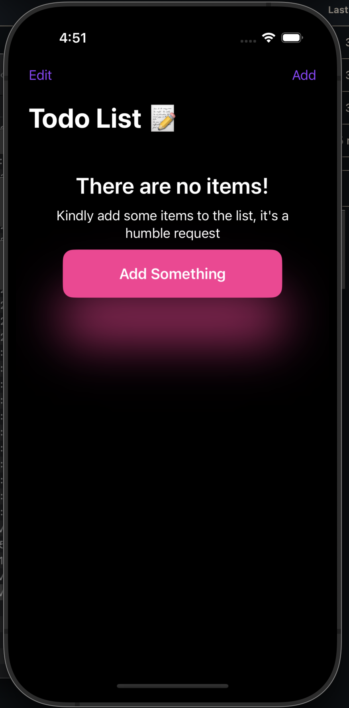
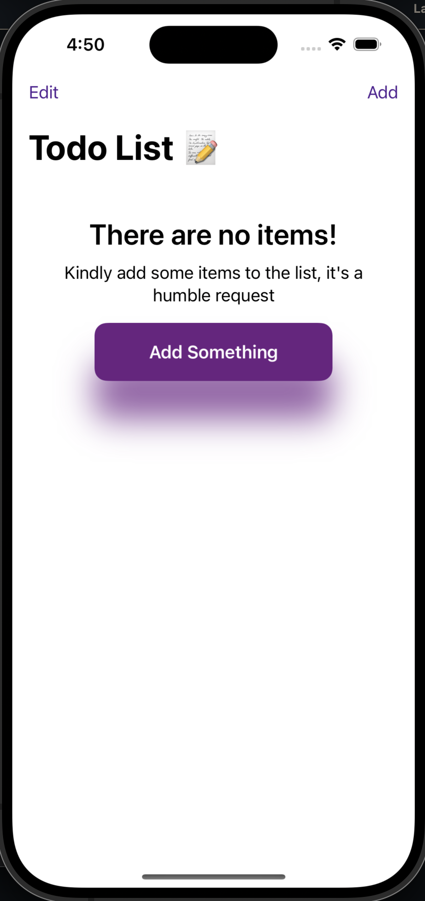

# 📝 To-Do List App

A simple and intuitive To-Do List app built in SwiftUI following **Swiftful Thinking's tutorial series**.  
This app allows users to add, delete, and mark tasks as completed, with persistent storage so your tasks remain even after the app is closed.

---

## 📱 Features
- Add new tasks with ease
- Mark tasks as complete/incomplete
- Delete tasks with swipe gestures
- Persistent storage using `@AppStorage` or `CoreData` (depending on implementation)
- Supports **Dark Mode** and **Light Mode**
- Clean and responsive SwiftUI design

---

## 🎥 Dark Mode vs Light Mode

| Dark Mode | Light Mode |
|-----------|------------|
|  |  |

